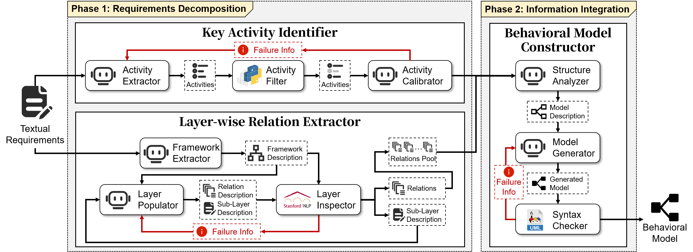
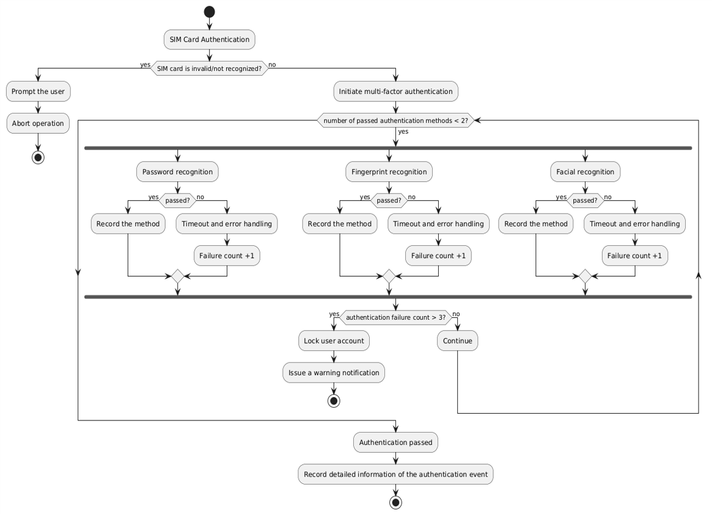

# LATO - Layerwise Analysis-driven auTomatic behavioral mOdeling

This is the artifact repository of LATO (Layerwise Analysis-driven auTomatic behavioral mOdeling)

## Repository Structure

```text
LATO/
├── src/                    # Source code
│   ├── modules/            # Core logic modules (Identify, Extract, Construct, Integrate)
│   ├── utils/              # Utility scripts and configuration
│   │   ├── config_loader.py# Configuration loader
│   │   └── args.yaml       # LLM API configuration
│   └── workflow.py         # Main workflow implementation (AutoBM)
├── experiments/            # Experimental scripts
│   ├── cot.py              # Chain-of-Thought implementation
│   ├── few_shot.py         # Few-shot implementation
│   └── zero_shot.py        # Zero-shot implementation
├── dataset/                # Evaluation datasets and annotation guidelines
├── figures/                # Figures used in documentation
├── requirements.txt        # Python dependencies
└── README.md               # Project documentation
```

## Setup & Installation

### 1. Python Environment
Install the required Python dependencies:
```bash
pip install -r requirements.txt
```

### 2. External Tools
LATO requires the following external tools to be installed and accessible:
- **PlantUML**: `plantuml-1.2025.4.jar` (Place in `src/utils/plantuml/` or configure path in `src/modules/construct.py`)
- **StanfordNLP**: CoreNLP 4.5.10 (Server must be running locally)
- **FastCoref**: `fastcoref 2.1.6` (Installed via pip)
- **SpaCy Model**: `en_core_web_sm`
  ```bash
  python -m spacy download en_core_web_sm
  ```

### 3. Configuration
Configure your LLM API credentials in `src/utils/args.yaml`

## Usage

The main entry point for the LATO workflow is `src.workflow.LATO`. 

Example usage (pseudo-code):
```python
from src.utils.config_loader import setup
from src.workflow import LATO

# Initialize LLM
llm = setup('deepseek', 'src/utils/args.yaml')

# Initialize LATO Workflow
lato = LATO(llm)

# Run Workflow
result = lato.workflow(input_text, examples_path="./prompts/")
print(result)
```

## Approach
<div align="center">
  
  <p><em>Figure 2. Overview</em></p>
</div>

## Example Generated Result
<div align="center">
  
  <p><em>Figure 3. Generated Result by LATO</em></p>
</div>

Also, you can find detailed prompt examples we crafted in [Examples Used in Prompting](./examples_in_prompt.md)
